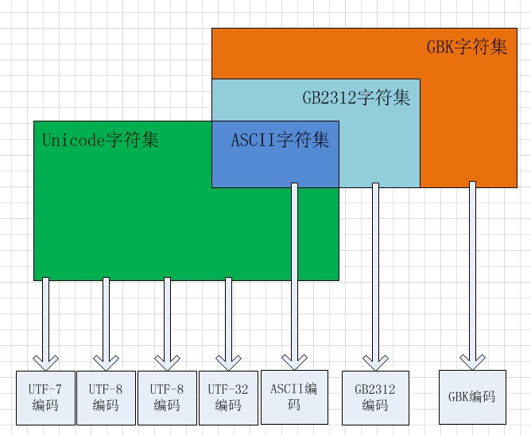

#4.1.字符集与编码
  众所周知，在计算机内部，所有的信息都是以0或1存储的，存储0或1的单元称为"位"(bit)，以8位为一组，称为"字节"(byte)。
在计算机诞生之初，人们为了能让计算机处理字符，于是就使用了一个对照表将字符"翻译"为01序列。例如：

```
二进制     字符
00110000    0
00110001    1
  ...      ... 
00111001    9
01000001    A
01000010    B
  ...      ...
01011010    Z
```

按照这个对照表，HELLO WORLD!可以使用二进制存储在计算机里。

```
文本：HELLO WORLD!
二进制：01001000 01000101 01001100 01001100 01001111 00100000 01010111 01001111 01010010 01001100 01000100 00100001
```
##4.1 字符集
上面提到的**“对照表”**我们称之为**“字符集”**，字符集就是计算机01序列与字符的对照表。常见的字符集有：

###4.1.1 ASCII字符集

以一个字节为单位（一个字节有8个位元）的对照表，可以提供2^8=256个字符映射。

###4.1.2 GB2312字符集

GB2312：中华人民共和国国家标准简体中文字符集。

ASCII的256个字符映射表显然不足以容纳博大精深的中文字体，于是天朝发明了GB2312字符集。GB2313字符集采用两个字节进行编号，理论上可容纳2^16=65536个字符编号，而实际上只收录了6763个汉字。

###4.1.3 GBK字符集

GB2312只收录了部分简体中文，对于部分中文姓，中文繁体，日文假名，还包括希腊字母以及俄语字母等字母并不支持，于是天朝又发明了GBK字符集对这部分字符进行收录。GBK字符集依然采用两个字节对字符进行编号，并且兼容GB2312，所以说GBK是GB23112的拓展。

###04.1.4 Unicode字符集

如果每个国家都发明各自的字符集编号，那么对信息编码将混乱不堪，于是有人就发明了Unicode，Unicode统一将世界上的符号都进行编号，用数字0-0x10FFFF来映射这些字符，可以容纳世界上所有的文字与符号。
 
与ASCII、GB2312、GBK字符集不同的是，Unicode并没有固定的字符编码。ASCII字符集对应ASCII编码、GB2312字符集对应GB2312编码，而Unicode字符集对应多种编码：UTF-7、UTF-8、UTF-16、UTF-82。我们常用的Unicode字符编码有：UTF-8和UTF-16。


##4.2 字符编码

编码
  如上面这个例子，将HELLO WORLD!翻译为01二进制序列的这个过程叫做"编码"。

##1.2解码
  同样地，如果将01二进制序列翻译为HELLO WORLD!这个过程叫做"解码"。
  
##1.3 ASCII
  而在上面的这个翻译过程中，无论文本翻译为二进制还是二进制翻译为文本，这个对照表都是至关重要的，它就相当于中英互译字典。
它制定了整个翻译过程的对照表。在计算机领域，我们称这个为"字符集"。而ASCII就是这么一个字符集，而上面的对照表也是ASCII的一部分。

  由于各种局限，ASCII最初只是用了一个字节的前7位来表示字符，它只包含了基本的大小写英文字符、数字、符号以及控制字符，共2^7=128个字符。这个称为基本ASCII码。
  
  但当计算机技术发展到欧洲的时候，人们发现原来的128个字符远远满足不了欧盟各国的需求，于是，人们就将原来的7位拓展到8位。那样就可以表示2^8=258为字符了。这称为拓展ASCII码。
  
  即使将原来的128个字符拓展到258个字符，远远满足不了欧盟那么多个国家的需求的，人们做了一个折中的做法。在另外拓展的128个字符中，个个国家使用的对照表是不一样的，例如：
  
```
130在法语编码中代表了é，在希伯来语编码中却代表了字母Gimel (ג)，在俄语编码中又会代表另一个符号.
```
  
  虽然拓展ASCII码满足了当时欧洲人的需求，但是也带来了很多副作用，各个国家的使用的拓展ASCII的128-258位的对照表是不一致的，那就各个国家的交流带来障碍。
    
  更糟糕的时，随着计算机的普及，原来的258个字符已经远远满足不了各国需求，单单中国汉字就高达十几万。于是GBK2313、JIS等应运而生。
  
##1.4 ANSI

  为了各自的语言字符需求，不同的国家和地区制定了不同的标准、例如中国有GBK2313、日本有JIS、这些字符集都是使用两个字节来进行拓展。
这些使用2个字节来代表一个字符的各种汉字延伸编码方式，称为 ANSI 编码。在简体中文系统下，ANSI 编码代表 GB2312 编码，在日文操作系统下，
ANSI 编码代表 JIS 编码。 不同 ANSI 编码之间互不兼容，当信息在国际间交流时，无法将属于两种语言的文字，存储在同一段 ANSI 编码的文本中。 
  
##1.5 unicode

  为了统一字符编码混乱的局面，统一码联盟推出了unicode字符集，也成为统一码。之所以成为统一码，是因为它收录了世界上绝大部分的字符，
并为每一个字符统一了该字符在计算机上存储的二进制码。每一个字符的二进制码都是唯一确定的。

  目前正在使用的unicode版本为UCS-2，使用16位的编码空间。也就是每个字符占用2个字节。这样理论上一共最多可以表示216（即65536）个字符。
基本满足各种语言的使用。实际上目前版本的統一碼並未完全使用这16位编码，而是保留了大量空间以作为特殊使用或将来扩展。




##1.6 unicode与utf8的关系
  
  
  总计总结总计总结

  
